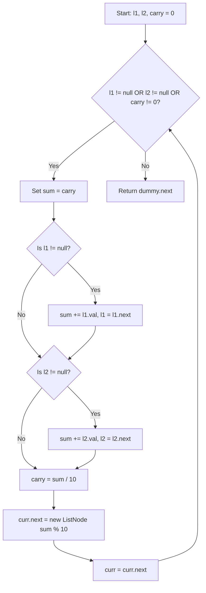

<h2><a href="https://leetcode.com/problems/add-two-numbers">2. Add Two Numbers</a></h2>

<p>You are given two <strong>non-empty</strong> linked lists representing two non-negative integers. The digits are stored in <strong>reverse order</strong>, and each of their nodes contains a single digit. Add the two numbers and return the sum&nbsp;as a linked list.</p>

<p>You may assume the two numbers do not contain any leading zero, except the number 0 itself.</p>

<p>&nbsp;</p>
<p><strong class="example">Example 1:</strong></p>

<pre><strong>Input:</strong> l1 = [2,4,3], l2 = [5,6,4]
<strong>Output:</strong> [7,0,8]
<strong>Explanation:</strong> 342 + 465 = 807.
</pre>

<p><strong class="example">Example 2:</strong></p>

<pre><strong>Input:</strong> l1 = [0], l2 = [0]
<strong>Output:</strong> [0]
</pre>

<p><strong class="example">Example 3:</strong></p>

<pre><strong>Input:</strong> l1 = [9,9,9,9,9,9,9], l2 = [9,9,9,9]
<strong>Output:</strong> [8,9,9,9,0,0,0,1]
</pre>

<p>&nbsp;</p>
<p><strong>Constraints:</strong></p>

<ul>
	<li>The number of nodes in each linked list is in the range <code>[1, 100]</code>.</li>
	<li><code>0 &lt;= Node.val &lt;= 9</code></li>
	<li>It is guaranteed that the list represents a number that does not have leading zeros.</li>
</ul>


---

# Add-Two-Numbers | Explained

## Approach 1: Iterative Elementary Math Simulation with Dummy Head

### Intuition

Think back to how you learned basic addition in primary school. When you add two multi-digit numbers on paper, you align them to the right (at the units place), add the digits together, write down the single digit result, and pass any carry-over value (a 1) to the next column on the left.

The key advantage of this problem structure is that the input linked lists are already stored in reverse order. This means the head of each linked list corresponds to the least significant digit (the units place). 

Because of this reversed format, we do not need to traverse to the end of the lists first or reverse them. We can directly process the nodes sequentially from left to right, exactly mimicking paper addition column-by-column.

### Algorithm Visualized



### Approach

1. **Initialize a Dummy Head**: We create a sentinel `dummy` node to act as the fixed anchor for our new linked list. We also maintain a `curr` pointer initialized to `dummy`, which moves forward as we append result nodes.
2. **Maintain a Carry Variable**: Initialize an integer `carry = 0` to track overflow between columns.
3. **Loop Until Processing Ends**: We run a `while` loop as long as `l1` has nodes, `l2` has nodes, OR `carry` is non-zero. Including `carry != 0` in the condition ensures that if the final addition produces an extra digit (like 5 + 5 = 10), we don't drop the final carry.
4. **Digit Accumulation**:
   - Start `sum` with the current `carry`.
   - If `l1` is not null, add `l1.val` to `sum` and move `l1` forward.
   - If `l2` is not null, add `l2.val` to `sum` and move `l2` forward.
5. **Compute Carry and Digit**:
   - The new `carry` is `sum / 10` (integer division).
   - The digit to store in the output node is `sum % 10`.
6. **Append Node**: Construct a new `ListNode` with value `sum % 10`, attach it to `curr.next`, and advance `curr`.
7. **Return Result**: Once the loop terminates, return `dummy.next` (skipping the initial placeholder node).

### Detailed Code Analysis

Let's break down the logic of the code block by block.

#### Step 1: Initializing Variables
```java
ListNode dummy = new ListNode(0);
ListNode curr = dummy;
int carry = 0;
```
- `dummy` acts as a placeholder node. This eliminates edge cases where we would otherwise need to write extra conditional logic to handle creating the root/head node of the output list.
- `curr` is our working pointer that always points to the tail of the newly created list.
- `carry` stores values carried over from adding the previous digits (0 or 1).

#### Step 2: Main Processing Loop
```java
while (l1 != null || l2 != null || carry != 0) {
```
- We use logical OR (`||`). The loop keeps running if list 1 still has digits, list 2 still has digits, OR if there's a leftover carry digit from the previous step.

#### Step 3: Extracting Values and Advancing Input Pointers
```java
int sum = carry;
if (l1 != null) {
    sum += l1.val;
    l1 = l1.next;
}
if (l2 != null) {
    sum += l2.val;
    l2 = l2.next;
}
```
- We reset `sum` to `carry` at the start of each iteration.
- We check if `l1` is non-null before accessing `l1.val`. If present, we add its value and safely advance `l1 = l1.next`.
- We perform the exact same null check for `l2`. This allows the algorithm to smoothly process lists of unequal lengths without throwing a `NullPointerException`.

#### Step 4: Modulo Arithmetic and Constructing the Output List
```java
carry = sum / 10;
curr.next = new ListNode(sum % 10);
curr = curr.next;
```
- `sum / 10` extracts the tens digit (e.g., `13 / 10 = 1`), which becomes our carry for the next iteration.
- `sum % 10` extracts the units digit (e.g., `13 % 10 = 3`), which forms the value for the current node.
- `curr.next = new ListNode(...)` links the new node to the tail of our result list, and `curr = curr.next` moves the tail pointer forward.

#### Step 5: Returning the Result
```java
return dummy.next;
```
- Since `dummy` was a dummy placeholder node at index -1, `dummy.next` points directly to the real head of our computed answer list.

### Code

```java
/**
 * Definition for singly-linked list.
 * public class ListNode {
 *     int val;
 *     ListNode next;
 *     ListNode() {}
 *     ListNode(int val) { this.val = val; }
 *     ListNode(int val, ListNode next) { this.val = val; this.next = next; }
 * }
 */
class Solution {
    public ListNode addTwoNumbers(ListNode l1, ListNode l2) {
        ListNode dummy = new ListNode(0);
        ListNode curr = dummy;
        int carry = 0;
        
        while (l1 != null || l2 != null || carry != 0) {
            int sum = carry;
            
            if (l1 != null) {
                sum += l1.val;
                l1 = l1.next;
            }
            if (l2 != null) {
                sum += l2.val;
                l2 = l2.next;
            }
            
            carry = sum / 10;
            curr.next = new ListNode(sum % 10);
            curr = curr.next;
        }
        
        return dummy.next;
    }
}
```

### Complexity

- **Time Complexity:** $O(\max(N, M))$, where $N$ is the number of nodes in `l1` and $M$ is the number of nodes in `l2`. The loop runs at most $\max(N, M) + 1$ times (the extra iteration accounts for a potential trailing carry). Inside the loop, all operations (addition, modulo, division, pointer assignments) execute in $O(1)$ constant time.
- **Space Complexity:** $O(\max(N, M))$ total space. The length of the new linked list is at most $\max(N, M) + 1$. Auxiliary space (excluding the returned list) is $O(1)$ since we only allocate standard primitives (`sum`, `carry`) and a couple of pointers (`dummy`, `curr`).

## Follow-up Questions

### 1. What if the digits in the linked list are stored in forward order instead of reverse order?

**Answer:**
If digits are ordered from most significant to least significant (e.g., `(3 -> 4 -> 2) + (4 -> 6 -> 5)` for `342 + 465`), we cannot process digits from left to right because carries propagate from right to left.

To solve this, we have two primary options:
1. **Reverse both input lists**: Reverse `l1` and `l2` in $O(N + M)$ time using standard iterative linked list reversal, perform the standard addition algorithm as written above, and then reverse the output list before returning it.
2. **Use Stacks**: Traverse `l1` and `l2` and push node values onto two separate stacks (`Stack<Integer>`). Stacks give us Last-In-First-Out (LIFO) order, allowing us to pop values starting from the units place upwards, computing the carry and prepending nodes to our result list.

### 2. Can we optimize auxiliary memory by modifying one of the input lists in-place?

**Answer:**
Yes. Instead of creating a brand new node (`new ListNode(sum % 10)`) at every iteration, we could overwrite the `.val` fields of `l1` (or `l2`). If one list runs out of nodes, we re-link the remaining nodes from the longer list onto our working list.

While this reduces dynamic memory allocations, mutating input parameters in production software is generally considered a bad practice unless strictly required, as it can cause unexpected side effects elsewhere in the application if other threads or functions hold references to the input lists.