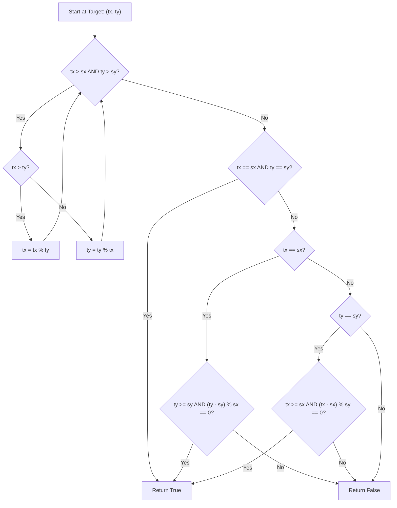

<h2><a href="https://leetcode.com/problems/reaching-points">780. Reaching Points</a></h2>

<p>Given four integers <code>sx</code>, <code>sy</code>, <code>tx</code>, and <code>ty</code>, return <code>true</code><em> if it is possible to convert the point </em><code>(sx, sy)</code><em> to the point </em><code>(tx, ty)</code> <em>through some operations</em><em>, or </em><code>false</code><em> otherwise</em>.</p>

<p>The allowed operation on some point <code>(x, y)</code> is to convert it to either <code>(x, x + y)</code> or <code>(x + y, y)</code>.</p>

<p>&nbsp;</p>
<p><strong class="example">Example 1:</strong></p>

<pre><strong>Input:</strong> sx = 1, sy = 1, tx = 3, ty = 5
<strong>Output:</strong> true
<strong>Explanation:</strong>
One series of moves that transforms the starting point to the target is:
(1, 1) -&gt; (1, 2)
(1, 2) -&gt; (3, 2)
(3, 2) -&gt; (3, 5)
</pre>

<p><strong class="example">Example 2:</strong></p>

<pre><strong>Input:</strong> sx = 1, sy = 1, tx = 2, ty = 2
<strong>Output:</strong> false
</pre>

<p><strong class="example">Example 3:</strong></p>

<pre><strong>Input:</strong> sx = 1, sy = 1, tx = 1, ty = 1
<strong>Output:</strong> true
</pre>

<p>&nbsp;</p>
<p><strong>Constraints:</strong></p>

<ul>
	<li><code>1 &lt;= sx, sy, tx, ty &lt;= 10<sup>9</sup></code></li>
</ul>


---

# Reaching Points | Explained

## Approach 1: Reverse Modulo ( Euclidean-like Backward Search )

### Intuition
If you try to move forward from the starting point `(sx, sy)` to the target point `(tx, ty)`, at every step you have two choices: go to `(x + y, y)` or `(x, x + y)`. This creates a binary decision tree. Exploring this tree forward results in an exponential number of paths $O(2^N)$, which quickly leads to Time Limit Exceeded (TLE).

However, if you work **backward** from `(tx, ty)` to `(sx, sy)`, the choice becomes completely deterministic. 
Given a state `(x, y)`:
- If `x > y`, the previous state **must** have been `(x - y, y)` because all numbers involved are positive.
- If `y > x`, the previous state **must** have been `(x, y - x)`.

Doing step-by-step subtraction `x = x - y` can still be too slow if `x` is vastly larger than `y` (for instance, `tx = 10^9` and `ty = 1`). Repeated subtraction is simply division. We can jump multiple subtraction steps in $O(1)$ time using the modulo operator `%`, exactly like the Euclidean Algorithm used for finding the Greatest Common Divisor (GCD).

### Algorithm Visualized



### Approach
1. **Backward Reduction Loop**: While both target coordinates are strictly greater than the source coordinates (`tx > sx && ty > sy`), shrink the larger coordinate using modulo.
   - If `tx > ty`, `tx` becomes `tx % ty`.
   - Otherwise, `ty` becomes `ty % tx`.
2. **Terminal Base Case Checks**: Once the loop terminates, at least one coordinate has reached or dropped below its corresponding source coordinate. We then check three possibilities:
   - Both match exactly (`tx == sx && ty == sy`): Return `true`.
   - `tx` matches `sx`: Since `tx` can no longer change, `ty` can only change by repeatedly subtracting `sx`. Check if `ty >= sy` and if the distance `(ty - sy)` is evenly divisible by `sx`.
   - `ty` matches `sy`: Since `ty` can no longer change, `tx` can only change by repeatedly subtracting `sy`. Check if `tx >= sx` and if the distance `(tx - sx)` is evenly divisible by `sy`.
3. If none of these conditions are met, it is impossible to reach `(tx, ty)` from `(sx, sy)`, so return `false`.

### Detailed Code Analysis

```java
1class Solution {
2    public boolean reachingPoints(int sx, int sy, int tx, int ty) {
3        while(tx>sx && ty>sy){
4            if(tx>ty){
5                tx%=ty;
6            }
7            else{
8                ty%=tx;
9            }
10       }
```
- **Lines 3–10**: This loop performs the accelerated backward reduction. We continue as long as both `tx > sx` and `ty > sy`. Using modulo allows us to compress thousands of subtraction steps into a single arithmetic operation.

```java
11        if(tx==sx && ty==sy){
12            return true;
13        }
```
- **Lines 11–13**: Handles the scenario where our modulo reductions land directly on the source coordinates `(sx, sy)`.

```java
14        if(tx==sx ){
15            return ty>sy && (ty-sy)%sx==0;
16        }
```
- **Lines 14–16**: If `tx` has matched `sx`, `tx` cannot be reduced any further. The only valid move from here would be repeatedly adding `sx` to `sy` to reach `ty`. Thus, `ty` must be greater than or equal to `sy`, and the gap `(ty - sy)` must be a multiple of `sx`. 
*(Note: Using `ty >= sy` is safer than `ty > sy` to account for exact equality, though line 11 already handles exact matches).*

```java
17        if(ty==sy){
18            return tx>sx&&(tx-sx)%sy==0;
19        }
20        return false;
21    }
22}
```
- **Lines 17–19**: The symmetric check for when `ty` matches `sy`. We check if `tx` can reach `sx` by subtracting multiples of `sy`.
- **Line 20**: If one coordinate fell below the source coordinate without the other matching, or if the remaining distance is not cleanly divisible, return `false`.

### Code

```java
class Solution {
    public boolean reachingPoints(int sx, int sy, int tx, int ty) {
        while (tx > sx && ty > sy) {
            if (tx > ty) {
                tx %= ty;
            } else {
                ty %= tx;
            }
        }
        
        if (tx == sx && ty == sy) {
            return true;
        }
        if (tx == sx) {
            return ty >= sy && (ty - sy) % sx == 0;
        }
        if (ty == sy) {
            return tx >= sx && (tx - sx) % sy == 0;
        }
        
        return false;
    }
}
```

### Complexity

- **Time Complexity:** $O(\log(\min(tx, ty)))$
  Because the modulo operations mirror the Euclidean Algorithm for finding the GCD, the larger value is reduced by at least half every two steps in the worst case. This gives logarithmic time complexity.

- **Space Complexity:** $O(1)$
  The algorithm runs iteratively using a few primitive integer variables without any additional data structures or recursion frames, keeping auxiliary space constant.

---

## Follow-up Questions

### 1. Why does simple backward subtraction `tx -= ty` fail with Time Limit Exceeded (TLE)?
If `tx = 10^9` and `ty = 1`, performing `tx -= ty` will execute $10^9$ times, causing a TLE. The modulo operator `tx %= ty` calculates the remainder of division instantly, reducing $10^9$ subtraction steps down to a single $O(1)$ step.

### 2. Can we solve this problem using Forward BFS or DFS with Memoization?
No. Moving forward generates a search tree of depth up to $10^9$ with branching factor 2. A BFS/DFS would require $O(2^N)$ time and memory, leading to Memory Limit Exceeded (MLE) or TLE. Furthermore, memoization is ineffective because the state space is too vast to store in a hash map. Backward reduction is deterministic, eliminating the need for graph traversal.