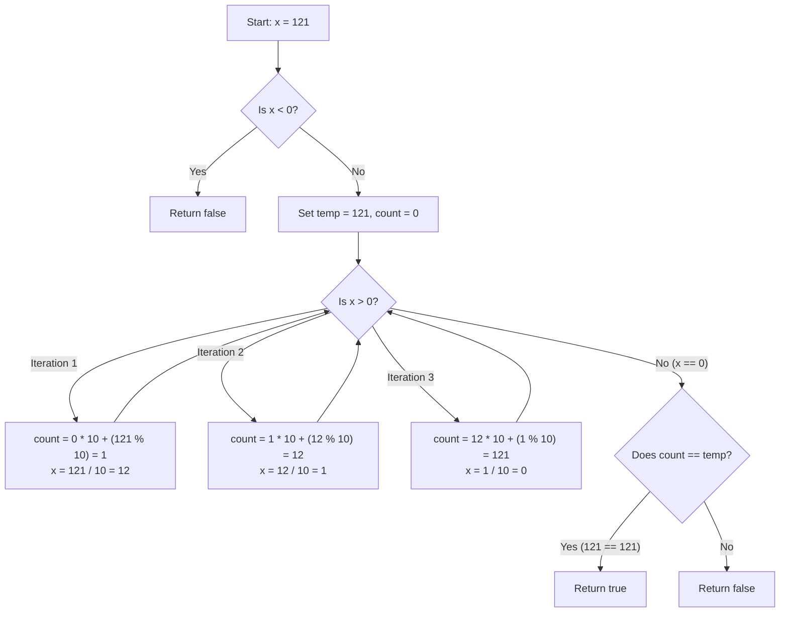

<h2><a href="https://leetcode.com/problems/palindrome-number">9. Palindrome Number</a></h2>

<p>Given an integer <code>x</code>, return <code>true</code> if <code>x</code> is a <span data-keyword="palindrome-integer" class=" cursor-pointer relative text-dark-blue-s text-sm"><button type="button" aria-haspopup="dialog" aria-expanded="false" aria-controls="radix-_r_1l_" data-state="closed" class=""><strong>palindrome</strong></button></span>, and <code>false</code> otherwise.</p>

<p>&nbsp;</p>
<p><strong class="example">Example 1:</strong></p>

<pre><strong>Input:</strong> x = 121
<strong>Output:</strong> true
<strong>Explanation:</strong> 121 reads as 121 from left to right and from right to left.
</pre>

<p><strong class="example">Example 2:</strong></p>

<pre><strong>Input:</strong> x = -121
<strong>Output:</strong> false
<strong>Explanation:</strong> From left to right, it reads -121. From right to left, it becomes 121-. Therefore it is not a palindrome.
</pre>

<p><strong class="example">Example 3:</strong></p>

<pre><strong>Input:</strong> x = 10
<strong>Output:</strong> false
<strong>Explanation:</strong> Reads 01 from right to left. Therefore it is not a palindrome.
</pre>

<p>&nbsp;</p>
<p><strong>Constraints:</strong></p>

<ul>
	<li><code>-2<sup>31</sup>&nbsp;&lt;= x &lt;= 2<sup>31</sup>&nbsp;- 1</code></li>
</ul>

<p>&nbsp;</p>
<strong>Follow up:</strong> Could you solve it without converting the integer to a string?

---

# 🛍️ Palindrome-Number | Explained

## Approach 1: Full Integer Reversal

### Intuition
Think of a palindrome like looking at a word in a mirror or reading a number backwards. If you spell `121` backwards, you still get `121`. But if you read `123` backwards, you get `321`, which isn't the same number.

To check if a number is a palindrome mathematically without converting it to a String, we can pop the digits off the end of our input number one by one (from right to left) and reconstruct them in reverse order (from left to right). If our reconstructed reverse number matches our original starting number, we've got a palindrome!

There is one quick shortcut: negative numbers (like `-121`) can **never** be palindromes because the negative sign stays at the front, turning it into `121-` when reversed.

### Algorithm Visualized



### Approach
1. **Edge Case Check**: If $x < 0$, immediately return `false`.
2. **Preserve State**: Save the original value of $x$ into a temporary variable (`temp`) because we will destroy $x$ by continuously dividing it by 10 inside our loop.
3. **Build the Reversed Number**:
   - Initialize an accumulator variable `count = 0` (which acts as our reversed number).
   - Loop while $x > 0$:
     - Shift existing digits in `count` left by multiplying by 10 (`count = count * 10`).
     - Extract the last digit of $x$ using modulo 10 (`x % 10`) and add it to `count`.
     - Remove the last digit from $x$ using integer division (`x = x / 10`).
4. **Final Comparison**: Compare the fully reversed value (`count`) with the preserved original value (`temp`). If they match, return `true`; otherwise, return `false`.

### Detailed Code Analysis

Let's do a deep dive into the exact Java code provided:

```java
class Solution {
    public boolean isPalindrome(int x) {
        int temp=x;
```
* **Line 3**: We store the initial value of `x` in `temp`. Why? Because our reversal loop will repeatedly divide `x` down to `0`. Without saving it in `temp`, we wouldn't have the original value left to compare against at the end.

```java
        if(x<0){
            return false;
        }
```
* **Lines 4–6**: This acts as an early guard clause. Any negative integer (e.g., `-121`) reversed becomes `121-`, which is invalid. Returning `false` immediately saves unnecessary processing time.

```java
        int count=0;
        while(x>0){
            count=count*10;
            count=count + (x%10);
            x=x/10;
        }
```
* **Lines 7–12**: This is the heart of the algorithm.
  * `count` accumulates the reversed digits (a more descriptive variable name like `reversedNum` is often preferred, but `count` works identically here).
  * `count = count * 10`: Opens up a new base-10 digit place on the right.
  * `count = count + (x % 10)`: `x % 10` isolates the rightmost digit of `x`. We add this digit into our newly opened position.
  * `x = x / 10`: Performs integer division to strip off the rightmost digit of `x` so we can process the next digit in the subsequent iteration.

```java
        if(count==temp){
            return true ;
        }
        else{
            return false;
        }
    }
}
```
* **Lines 13–18**: Once `x` hits `0`, the loop ends. `count` now contains the fully reversed number. We check if `count == temp`.
* *Pro-tip*: Instead of the `if-else` block, you could cleanly condense lines 13–18 into a single line: `return count == temp;`.

### Code

```java
class Solution {
    public boolean isPalindrome(int x) {
        int temp = x;
        
        if (x < 0) {
            return false;
        }
        
        int count = 0;
        while (x > 0) {
            count = count * 10;
            count = count + (x % 10);
            x = x / 10;
        }
        
        if (count == temp) {
            return true;
        } else {
            return false;
        }
    }
}
```

### Complexity

- **Time Complexity:** $\mathcal{O}(\log_{10}(N))$
  - In each iteration of the `while` loop, we divide $x$ by $10$. The total number of iterations equals the number of digits in the integer $x$, which is roughly $\log_{10}(x)$. Since a standard 32-bit integer has at most 10 digits, the loop runs at most 10 times—making this effectively an $\mathcal{O}(1)$ operation in practice.
  
- **Space Complexity:** $\mathcal{O}(1)$
  - We only allocate a few primitive integer variables (`temp`, `count`). Memory usage remains constant regardless of the magnitude of $x$.

---

## 🕵️‍♂️ Follow-up Questions

### 1. Could reversing the entire integer lead to an Integer Overflow issue?
**Answer:** Yes! In languages like Java or C++, a 32-bit signed integer can only store values up to `2,147,483,647` (`Integer.MAX_VALUE`). If a non-palindromic number like `1,534,236,469` is passed, reversing it completely yields `9,646,324,351`, which overflows a 32-bit integer and causes incorrect results.

**How to optimize it:** You can avoid overflow entirely by reversing **only half** of the number. When the reversed lower half of the digits becomes greater than or equal to the remaining upper half of the digits (`x <= reversedNum`), you stop processing and compare the two halves.

### 2. How do you handle numbers that end in zero (e.g., `10`, `100`)?
**Answer:** Any non-zero number ending in `0` (like `10`) can never be a palindrome because no positive integer starts with a leading `0`. You can add `x % 10 == 0 && x != 0` to your initial guard clause to immediately return `false` for these cases.